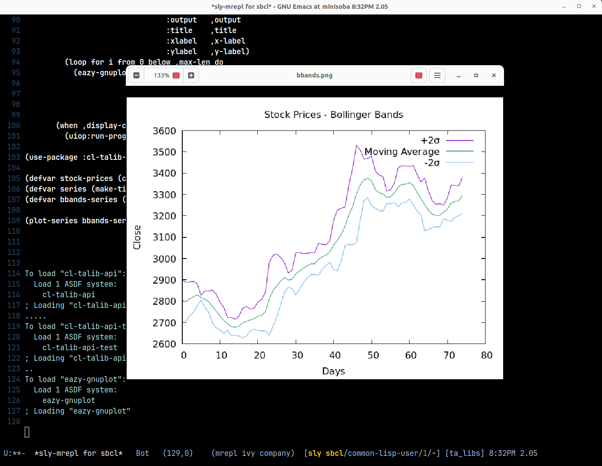

# TA-LIB API for Common Lisp

**cl-talib-api** is a Common Lisp wrapper for well-known technical analysis library - [TA-LIB](https://ta-lib.org/).
This library provides a wide range of technical analysis functions for financial market data,
including indicators like moving averages, Bollinger Bands, and relative strength index (RSI).
The wrapper allows Common Lisp developers to easily integrate these functions into their applications.

## Table of Contents

- [TA-LIB API for Common Lisp](#ta-lib-api-for-common-lisp)
- [System Requirements](#system-requirements)
- [Quick Start](#quick-start)
- [Indicators](#indicators)
  - [Overlap](#overlap)
  - [Momentum](#momentum)
  - [Volume](#volume)
  - [Volatility](#volatility)
- [Advance Usage](#advance-usage)
- [Unit Test](#unit-test)
- [License](#license)

## System Requirements

TA-LIB C library needs to be installed in the library path.

Currently, the software has been tested with the following Common Lisp implementations under Ubuntu 24.04.

- SBCL (2.1.1+)
- LispWorks (7.1+)

## Quick Start

All TA-LIB methods require a **TIME-SERIES** object. The **TIME-SERIES** class contains multiple time-series points
which must be of a foreign-object type. The **STOCK-PRICES** class provides a time-series of OHLCV
(Open, High, Low, Close, Volume) data using foreign data types.

```lisp
(ql:quickload :cl-talib-api)
(ql:quickload :cl-talib-api-test)

(use-package :cl-talib-api)

(defvar stock-prices (cl-talib-api.test:load-test-data))
```

The first parameter of all TA-LIB methods is one of the **TIME-SERIES** classes, and the type of the class is based
on the number of time-series points in the original TA-LIB method.

```
(defvar series (make-time-series-1 (close-prices-of stock-prices)))
(defvar bbands-series (bbands series 0 cl-talib-api.test:*end-idx*))
```

## Indicators

### overlap

- accbands
- bbands
- dema
- ema
- kama
- ma
- mama
- mavp
- midpoint
- midprice
- sar
- sar-ext
- sma
- t3
- tema
- trima
- wma

### momentum

- adx
- adxr
- apo
- aroon
- aroon-osc
- bop
- cci
- cmo
- dx
- macd
- macd-ext
- macd-fix
- mfi
- minus-di
- minus-dm
- mom
- plus-di
- plus-dm
- ppo
- roc
- rocp
- rocr
- rocr100
- rsi
- stoch
- stochf
- stoch-rsi
- trix
- ult-osc
- willr

### volume

- ad
- ad-osc
- obv

### volatility

- atr
- natr
- trange

## Advance Usage

The following example plots a Bollinger Bands using the test data.

```lisp
(ql:quickload :cl-talib-api)
(ql:quickload :cl-talib-api-test)
(ql:quickload :eazy-gnuplot)

(defmacro plot-series (series &key title output x-label y-label legends (display-cmd "eog"))
  (alexandria:with-unique-names (max-len)
    `(let ((,max-len 1))
       (unless (numberp (car ,series))
         (setf ,max-len (length (car ,series))))
       (eazy-gnuplot:with-plots (*standard-output* :debug nil)
         (eazy-gnuplot:gp-setup :terminal '(pngcairo)
                                :output   ,output
                                :title    ,title
                                :xlabel   ,x-label
                                :ylabel   ,y-label)
         (loop for i from 0 below ,max-len do
           (eazy-gnuplot:plot (lambda ()
                                (mapcar (lambda (x) (format t "~%~a" (if (numberp x)
                                                                         x
                                                                         (nth i x)))) ,series))
                              :with (list :lines :title (nth i ,legends)))))
       (when ,display-cmd
         (uiop:run-program (format nil "~a ~a" ,display-cmd ,output))))))

(use-package :cl-talib-api)

(defvar stock-prices (cl-talib-api.test:load-test-data))
(defvar series (make-time-series-1 (close-prices-of stock-prices)))
(defvar bbands-series (bbands series 0 cl-talib-api.test:*end-idx*))

(plot-series bbands-series :title   "Stock Prices - Bollinger Bands"
                           :output  "/tmp/bbands.png"
                           :x-label "Days"
                           :y-label "Close"
                           :legends '("+2σ" "Moving Average" "-2σ"))
```

<br/>

<div align="center">
    )
</div>

## Unit test

To run the unit tests, execute the following:

The verifications are done with data generated by [ta-lib-python](https://github.com/TA-Lib/ta-lib-python) and [pandas-ta](https://github.com/twopirllc/pandas-ta).

```lisp
(asdf:test-system :cl-talib-api-test)
```

## Known issues

**MAMA** is disable for Linux, undefined symbol for atan.

## License

Licensed under the **MIT License**
<br>
©️ 2025 **Y. IGUCHI**
