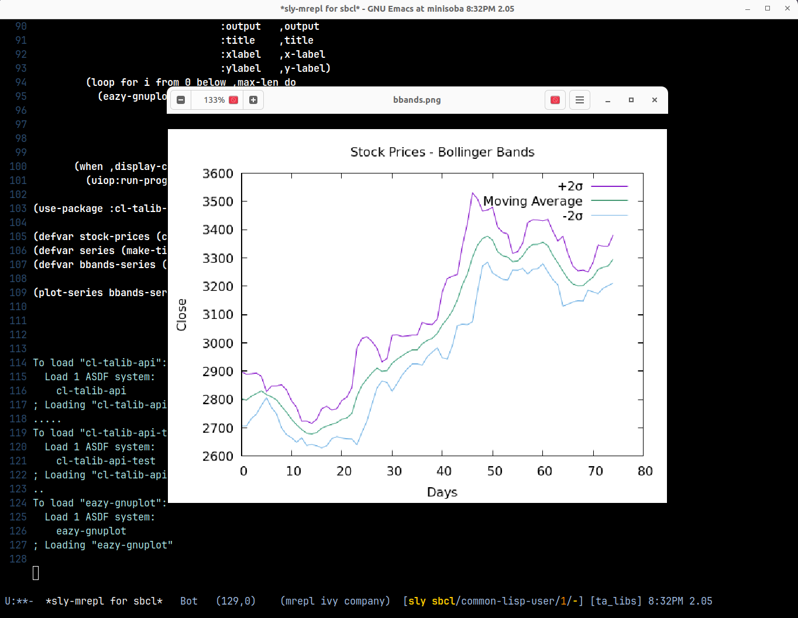

[English](../README.md) | [日本語](./README.md)

# TA-LIB API for Common Lisp

**cl-talib-api** は、有名なテクニカル分析ライブラリ [TA-LIB](https://ta-lib.org/) の Common Lisp ラッパーです。
このライブラリは、移動平均、ボリンジャーバンド、RSI（相対力指数）などの指標を含む、金融市場データ向けの幅広いテクニカル分析関数を提供します。
このラッパーにより、Common Lisp 開発者はこれらの関数を自身のアプリケーションに簡単に組み込むことができます。

## 目次

- [TA-LIB API for Common Lisp](#ta-lib-api-for-common-lisp)
- [動作環境](#動作環境)
- [クイックスタート](#クイックスタート)
- [インジケーター](#インジケーター)
  - [オーバーラップ](#オーバーラップ)
  - [モメンタム](#モメンタム)
  - [出来高](#出来高)
  - [ボラティリティ](#ボラティリティ)
- [上級者向け使用方法](#上級者向け使用方法)
- [ユニットテスト](#ユニットテスト)
- [ライセンス](#ライセンス)

## 動作環境

TA-LIB の C ライブラリをライブラリパスにインストールする必要があります。

現在、Ubuntu 24.04 環境において以下の Common Lisp 処理系での動作を確認しています。

- SBCL (2.1.1+)
- LispWorks (7.1+)

## クイックスタート

すべての TA-LIB メソッドは **TIME-SERIES** オブジェクトを必要とします。**TIME-SERIES** クラスは複数の時系列ポイントを保持し、それらは外部オブジェクト型でなければなりません。**STOCK-PRICES** クラスは外部データ型を使用した OHLCV（始値・高値・安値・終値・出来高）データの時系列を提供します。

```lisp
(ql:quickload :cl-talib-api)
(ql:quickload :cl-talib-api-test)

(use-package :cl-talib-api)

(defvar stock-prices (cl-talib-api.test:load-test-data))
```

すべての TA-LIB メソッドの第一引数は **TIME-SERIES** クラスのいずれかであり、クラスの型は元の TA-LIB メソッドにおける時系列ポイントの数に基づいています。

```
(defvar series (make-time-series-1 (close-prices-of stock-prices)))
(defvar bbands-series (bbands series 0 cl-talib-api.test:*end-idx*))
```

## インジケーター

### オーバーラップ

- accbands
- bbands
- dema
- ema
- kama
- ma
- mama
- mavp
- midpoint
- midprice
- sar
- sar-ext
- sma
- t3
- tema
- trima
- wma

### モメンタム

- adx
- adxr
- apo
- aroon
- aroon-osc
- bop
- cci
- cmo
- dx
- macd
- macd-ext
- macd-fix
- mfi
- minus-di
- minus-dm
- mom
- plus-di
- plus-dm
- ppo
- roc
- rocp
- rocr
- rocr100
- rsi
- stoch
- stochf
- stoch-rsi
- trix
- ult-osc
- willr

### 出来高

- ad
- ad-osc
- obv

### ボラティリティ

- atr
- natr
- trange

## 上級者向け使用方法

以下の例では、テストデータを使用してボリンジャーバンドをプロットします。

```lisp
(ql:quickload :cl-talib-api)
(ql:quickload :cl-talib-api-test)
(ql:quickload :eazy-gnuplot)

(defmacro plot-series (series &key title output x-label y-label legends (display-cmd "eog"))
  (alexandria:with-unique-names (max-len)
    `(let ((,max-len 1))
       (unless (numberp (car ,series))
         (setf ,max-len (length (car ,series))))
       (eazy-gnuplot:with-plots (*standard-output* :debug nil)
         (eazy-gnuplot:gp-setup :terminal '(pngcairo)
                                :output   ,output
                                :title    ,title
                                :xlabel   ,x-label
                                :ylabel   ,y-label)
         (loop for i from 0 below ,max-len do
           (eazy-gnuplot:plot (lambda ()
                                (mapcar (lambda (x) (format t "~%~a" (if (numberp x)
                                                                         x
                                                                         (nth i x)))) ,series))
                              :with (list :lines :title (nth i ,legends)))))
       (when ,display-cmd
         (uiop:run-program (format nil "~a ~a" ,display-cmd ,output))))))

(use-package :cl-talib-api)

(defvar stock-prices (cl-talib-api.test:load-test-data))
(defvar series (make-time-series-1 (close-prices-of stock-prices)))
(defvar bbands-series (bbands series 0 cl-talib-api.test:*end-idx*))

(plot-series bbands-series :title   "Stock Prices - Bollinger Bands"
                           :output  "/tmp/bbands.png"
                           :x-label "Days"
                           :y-label "Close"
                           :legends '("+2σ" "Moving Average" "-2σ"))
```

<br/>

<div align="center">
    )
</div>

## ユニットテスト

ユニットテストを実行するには、以下を実行してください。

検証は [ta-lib-python](https://github.com/TA-Lib/ta-lib-python) および [pandas-ta](https://github.com/twopirllc/pandas-ta) で生成したデータを使用して行われます。

```lisp
(asdf:test-system :cl-talib-api-test)
```

## 既知の問題

~~**MAMA** は Linux で無効になっています。atan の未定義シンボルが原因です。~~

**修正済み**: MAMA はすべてのプラットフォームで動作するようになりました。`atan` シンボルの問題は、`libta-lib.so` がランタイム時に `libm`（C の数学ライブラリ）を見つけられないことが原因でした。`lib/` に同梱されている `libta-lib.so` はすでに `libm` とリンクされているため、この問題は自動的に解決されます。TA-LIB をソースからビルドしてこの問題が発生した場合は、`libm` がリンクされていることを確認してください。

```bash
# TA-LIB をソースからビルドする際は、libm がリンクされていることを確認してください:
cd ta-lib && ./configure && make LDFLAGS="-lm" && sudo make install

# ビルドされたライブラリが libm とリンクされていることを確認:
ldd /usr/local/lib/libta-lib.so | grep libm
# 期待される出力: libm.so.6 => /lib/x86_64-linux-gnu/libm.so.6 (0x...)
```

浮動小数点パラメータ（例: `fast-limit`、`slow-limit`）を渡す際は、単精度浮動小数点数から倍精度浮動小数点数への変換による精度損失を避けるため、倍精度浮動小数点リテラル（例: `0.05d0`）を使用してください。

## ライセンス

**MIT ライセンス** に基づいてライセンスされています
<br>
©️ 2025 **Y. IGUCHI**
